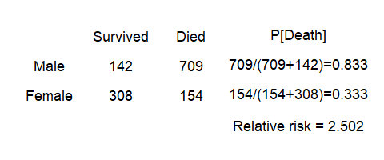
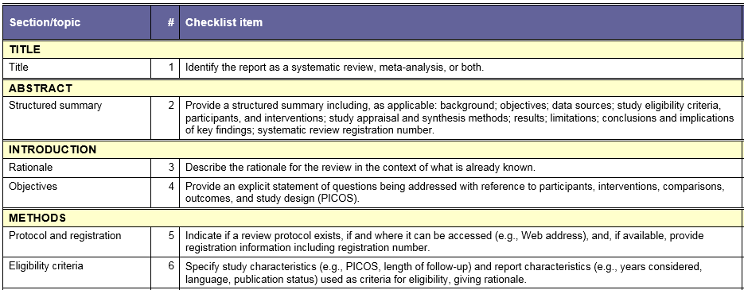

```{r prelims, echo=FALSE}
suppressMessages(suppressWarnings(library(knitr)))
opts_chunk$set(echo=FALSE, fig.width=6.5, fig.height=6.5)
suppressMessages(suppressWarnings(library(magrittr)))
suppressMessages(suppressWarnings(library(metafor)))
bcg <- get(data(dat.bcg))
los <- get(data(dat.normand1999))
```


## Abstract

Meta-analysis is the quantitative pooling of data from multiple studies. The three threats to the validity of a meta-analytic finding are heterogeneity, publication bias, and poor individual study quality. This talk will introduce you to the major design issues that you must address in your research protocol to insure that your meta-analysis will have credibility. 

<div class="notes">

Today's talk is a basic introduction. It will focus on design issues for a meta-analytic study.

</div>

## Abstract (continued)

You will also learn some of the fundamental graphical and analytic tools used in meta-analysis: the forest plot, Cochran’s Q and I-squared, the funnel plot, and the L’Abbe plot. You will compare the results from a fixed effects and a random effects model and understand the choices available for summary statistics. Finally, you will see how to publish your results using the PRISMA guidelines.

<div class="notes">

It will also cover some of the common statistics and graphics used in a meta-analytic study, and publication standards for a meta-analytic study.

</div>

## A motivating example


<div class="notes">

In 1992, the British Medical Journal published a controversial meta-analysis. This study (Carlsen 1992) reviewed 61 papers published from 1938 and 1991 and showed that there was a significant decrease in sperm count and in seminal volume over this period of time. 
</div>

## A motivating example


<div class="notes">

For example, a linear regression model on the pooled data provided an estimated average count of 113 million per ml in 1940 and 66 million per ml in 1990.

</div>

## Alternative analysis


<div class="notes">

Several researchers (Olsen 1995; Fisch 1996) noted heterogeneity in this meta-analysis, a mixing of apples and oranges. Studies before 1970 were dominated by studies in the United States and particularly studies in New York. Studies after 1970 included many other locations including Third World countries. 

</div>

## Additional sources of variation

* The source of patients
  + Sperm donor clinics,
  + Fertility work-ups
  + In vitro fertilization clinics
* Request for minimum abstinence time.
* Tobacco and marijauna use

<div class="notes">

There was also substantial variation from study to study in the source of patients. Sperm donor clinics typically ask donors to prove they are fertile (e.g., having fathered at least two children). A fertility work-up, on the other hand, is done in settings where fertility is questionable, and would not require such a condition. An in vitro clinic might have men with normal fertility, if the issue of infertility were restricted to the female side. But often a poor sperm count is a contributing factor to female infertility.

Another thing that varied from study to study were absitinence requirements. Some studies asked the men to abstain from sex for two days prior to providing a sample and some didn't. Abstinent men would tend to have higher sperm counts than non-abstinent men.

If patients who used tobacco or marijuana were excluded from some studies, but not from others, this could also affect sperm counts. 

</div>

## Illustration of strengths and weaknesses of meta-analysis

* Weakness

  + Mixing North American apples with third world oranges.
  
* Strengths

  + Objective process.
  
  + Ability to re-analyze.

<div class="notes">

This meta-analysis and the subsequent criticisms illustrate, at the same time, the greatest weakness and the greatest strength of meta-analysis.

</div>

## Apples and oranges

Here are the main threats to the validity of a meta-analysis:

* Did you mix apples and oranges? (heterogeneity)

* Did you leave some apples on the tree? (publication bias)

* Did the pile of apples amount to more than just a hill of beans? (no practical significance)

* Were all of the apples rotten? (poor study quality)

<div class="notes">

One of the seven habits of Steven Covey is "Begin with the end in mind." If you read the criticisms of meta-analysis, they tend to fall into four broad categories. You should design your study and analyze it keeping these criticisms in mind. You want to minimize the number of objections to your work.

</div>

## Did you mix apples and oranges?

Meta-analysis: a multi-center clinical trial where each center uses a different protocol.

How do clinical trials differ?

* How the patient population was selected.

* How the intervention was administered.

* How the controls were selected/treated.

* How the effectiveness of the intervention was measured.

<div class="notes">

There are many ways that one clinical trial can differ from another. One might study a severely ill group of patients and another might study a mildly ill group. The intervention studied could vary in the frequency and duration of the intervention. The controls could be given a placebo or the best available alternative. The outcome used to measure the intervention could be something as severe and final as death or it could be a surrogate marker (e.g., CD4 cell counts in an AIDS trial).

A little bit of heterogeneity is actually quite good. If a new therapy is shown to be effective across a range of patient populations using a variety of different outcomes, you have a robust result. Mixing apples and oranges is okay, it gives you fruit salad. But you're not supposed to mix apples and onions.

</div>

## You can examine heterogeneity using

* the forest plot

* L'Abbe plot

* Cochran's Q

* I-squared

* sensitivity/subgroup analysis

* meta regression

<div class="notes">

You can assess how much heterogeneity there is among your studies using graphical approaches, such as the forest plot and the L'Abbe plot, with numerical measures like Cochran's Q or I-squared, or through sensitivity and subgroup analyses or through meta regression.

You'll see how to calculate these quantities in just a bit.

</div>

## Did you leave some apples on the tree?

Publication bias is difficult to assess and difficult to control for. You should

* have a comprehensive search protocol

  + non-Medline indexed journals
  
  + conference presentations
  
  + clinical trial registries 

* assess publication bias using a funnel plot.

<div class="notes">

It is very important to try to get every study conducted in the area you're studying. Unpublished results and more likely to have negative results. It was originally thought to be because journals would preferentially publish only positive studies, but there is some evidence that authors self-censor the negative studies, especially negative studies with small sample sizes.

You need to try hard to find studies that are hard to find.

The funnel plot is a graphical method commonly used to identify whether publication bias has occured. We'll talk about it in a bit.

</div>

## Did the pile of apples amount to more than just a hill of beans?

Very few meta-analytic studies address practical significance

* Summary measures in meta-analysis are unitless.

* Translate your findings to a meaningful scale.

<div class="notes">

A neglected issue in meta-analysis is the practical interpretation of the results. You need to assess more than just the overall statistical significance of your meta-analysis. You need to consider the scientific or practical significance as well. 

The unitless quantities often used in meta-analysis make assessment of practical significance difficult. We'll address that issue in more detail in just a little bit.

</div>

## Were all of the apples rotten?

* Jadad (0-5 points total)
  + randomized? (0-2 points)
  + blinding (0-2 points)
  + information on dropouts (0-1 points)

* PEDro (0-11 points total)
  + randomization and baseline balance (0-3 points)
  + blinding (0-3 points)
  + dropouts, intention to treat (0-2 points)
  + completeness of reporting (0-3 points)

<div class="notes">

Meta-analysis cannot "make a silk purse out of a sow's ear." Meta-analysis cannot remove the biases and imprecision associated with poor research methodologies. If all of the studies have "issues" then a meta-analysis will amplify those issues.

There are two validated scales for measuring the quality of individual studies in a meta-analysis. Even though these scores are commonly used, they have endured a lot of criticism

You can assess quality issues by limiting studies based on scoring systems like Jadad or PEDro or by weighting studies based on these scores. We'll talk about this a bit later.

The Jadad score is quite common, and it looks at three issues: randomization, blinding, and dropouts.

The PEDro score is much longer. It covers not just randomization, but concealed allocation and baseline balance of important covariates. There are three questions about blinding: blinding of the subjects, blinding of the therapists who are offering the intervention, and blinding of anyone assessing the patient's outcomes. The PEDro score also looks at dropout rates, intention to treat analysis, and completeness of reporting on eligibility critera, statistical tests, and confidence intervals.

</div>

## Design of a meta-analytic study

Detailed protocol

* Get help from a librarian

* Search strategy

* Inclusion/exclusion criteria

* Process for extracting numerical results

<div class="notes">

A detailed protocol is a must for meta-analysis. You have to provide a level of detail comparable to a clinical trial. 
A librarian is especially helpful here.

Medline is a comprehensive database of research publications in medical journals. It's a great place to start, but you should also search in databases other than Medline, such as Embase and CINAHL.

Look through presentation abstracts at major conferences. Also look for clinical trials that have been registered in a clinical trial database.

Make sure you pay to get translations for relevant articles published in languages other than English.

Detail exactly which studies do and do not qualify for inclusion in your meta-analysis. Have two independent raters evaluate each candidate article against your inclusion/exclusion criteria.

Also, detail what results you are going to extract from each article. Have two independent parties do the extraction and then compare.

</div>

## Data analysis

* Pick a summary measure

* Forest plot,

* Cochran’s Q and I-squared,

* Funnel plot

* L’Abbe plot.

* Fixed versus random effects

* Meta regression

<div class="notes">

Let's talk about data analysis. This talk will cover several different statistical measures and several different plots. You'll also see controversies about fixed versus random effects analysis.

</div>

## Software

* R: see the CRAN Task View: Meta-Analysis 

* SAS: metaanal macro, various SAS conference presentations

* Stata: see Meta-Analysis in Stata: An Updated Collection from the Stata Journal, Second Edition

<div class="notes">

I will be using a package, metafor, in R, but there are many other R pacakges as well. Meta-analysis is not built into the SAS system. There is a pretty nice macro, metaanal, and you can find other information in various SAS conference presentations.

Stata also does not have a formal command in its system, but there is a very nice book that will tell you all about this.

</div>

## BCG description

"Results from 13 studies examining the effectiveness of the Bacillus Calmette-Guerin (BCG) vaccine against tuberculosis."

Available at the metafor project page in [html format](http://www.metafor-project.org/doku.php/tips:assembling_data_or).

<div class="notes">

I'll be showing some meta-analysis statistics and graphs for two studies. The first study is an examination of the tuberculosis vaccine. In these studies, treated patients were given the vaccine and untreated patients were given a placebo. A test was run later and a positive result means that the vaccine failed. I presume a positive result means that the patient came down with TB and this was confirmed by a positive lab test. Thanksfully, the rate of positive results was small both in the treated and untreated groups.

This data helps to illustrate how to conduct a meta-analysis on a binary outcome.

This data set comes with the metafor package in R, but you can get access to the raw data if you want to run the analysis in a different software package.

</div>

## BCG data, first three columns

```{r bcg-list1}
bcg[1:6, c("trial", "author", "year")]
```

<div class="notes">

This lists the first three columns of the BCG data, but only for the first six studies. There were thirteen studies total. These columns identify which study was which.

</div>


## BCG data, last six columns

```{r bcg-list2}
bcg[1:6, c("tpos", "tneg", "cpos", "cneg", "ablat", "alloc")]
```

<div class="notes">

The remaining columns give the number of positive and negative results in the treatment group and in the control group. The "ablat" variable is a measure of the absolute value of the latitude at which the study was done. A large value here means the study was conducted at a location far from the equator.

</div>

## LOS description

"Results from 9 studies on the length of the hospital stay of stroke patients under specialized care and under conventional/routine (non-specialist) care."

Available at the metafor project page in [html format](http://www.metafor-project.org/doku.php/tips:assembling_data_smd)

<div class="notes">

The second analysis looks at a specialized care model for stroke patients. This data set has a continuous outcome (length of stay). The analysis of continuous outcome data is slightly different.

This data set comes with the metafor package in R, but you can get access to the raw data if you want to run the analysis in a different software package.

</div>

## LOS data, first two columns

```{r los-list-1}
los[1:6, c("study", "source")]
```

<div class="notes">

The first two columns identify the particular study. I am only showing the first six rows out of nine rows total.

</div>

## LOS data, last six columns

```{r los-list-2}
los[1:6, c("n1i", "m1i", "sd1i", "n2i", "m2i", "sd2i")]
```

<div class="notes">

The remaining columns show the sample size (designative by the letter n), the mean length of stay (designated by the letter m) and the standard deviations (designated by the letters sd). The number "1" refers to the treatment group (specialized care) and "2" refers to the control group (normal care).

</div>

## The standardized mean difference (SMD)

For a continuous outcome, the standardized mean difference is computed as 

 $\hat \theta_i = \frac{\bar{X}_T-\bar{X}_C}{Estimated\;Standard\;Deviation}$

or

 $\hat \theta_i = \frac{\bar{X}_C-\bar{X}_T}{Estimated\;Standard\;Deviation}$

<div class="notes">

For continuous outcomes, the most common summary measure is the standardized mean difference. It is the difference in means divided by an estimate of the standard deviation (not the standard error) of an individual patient.

Which way do you subtract? It depends on whether a large value is good or a small value is good. The Cochrane Collaboration suggests subtracting in such a way that negative values suggest that the new treatment is better and positive values suggest that the control treatment is better.

</div>

## Estimating the standard deviation

Different estimated standard deviations

* Cohen's d (pooled standard deviation)

* Hedge's g (bias correction)

* Adjustments for heteroscedascity or pairing

<div class="notes">

There are several ways to estimate the standard deviation. With the exception of pairing, where the estimated standard deviation could be substantially lower, these approaches are not all that different.

</div>

## Cohen's d

Uses a pooled standard deviation.

 $S_p=\sqrt{\frac{n_TS_T^2+n_CS_C^2}{n_T+n_C}}{\;}$

<div class="notes">

The simplest standardized mean difference is Cohen's d. This is the famous Jacob Cohen who wrote "Statistical Power Analysis for the Behavioral Sciences" back in 1977 and invented to concept of effect size.

Cohen's d uses a pooled standard deviation in the denominator.

</div>

## Hedge's g

Pooled standard deviation adjusted by a bias correction factor

 $J \approx 1-\frac{3}{4df-1}$

<div class="notes">

Hedge's g multiples the pooled standard deviation by a bias correction factor. The exact form of the correction factor is messy, so sometimes an approximate formula based on the pooled degrees of freedom is used in its place.

Both the exact and the approximate bias adjustment formulas are less than one, making Hedge's g smaller than Cohen's d. But for large sample sizes, this adjustment becomes trivial.

</div>

## Adjusting for heteroscedascity

Two choices for heteroscedascity within a study

 $\sqrt{\frac{S_T^2+S_C^2}{2}}{\;}$

or

 $S_C$

<div class="notes">

If there is heterogeneity within a study, you can use the square root of the average the two variances or the square root of the control group variance.

I kind of like the second choice. How much better is the treatment relative to the control, in units of measurement relevant to the variation of the control group. Assuming normality, a full standard deviation means that the treatment median is at the 84th percentile of the control group.

</div>

## Adjusting for pairing

For pairing use

 $S_D$

if it is available, or

 $\sqrt{S_T^2+S_C^2-2\hat\rho S_TS_C}{\;}$

if it is not.

<div class="notes">

For paired data, use the standard deviation of the differences, if it reported, or estimate the standard deviation of the differences using a reasonable guess as to the correlation.

</div>

## Analyzing proportions

* Commonly used summary measures
  + Odds ratio
  + Relative risk
  + Risk difference
* Odds ratios and relative risk are always analyzed and displayed on a log scale.

<div class="notes">

When you are comparing proportions rather than means, you have three ways of summarizing your data. You can use the odds ratio, the relative risk, or the risk difference in proportions.

</div>

## Titanic data


<div class="notes">

You already have seen the various summary measures used for comparing two proportions, but let me review them anyway.

This is table from the Titanic, listing passengers only (not crew members) by gender and by whether they lived or died. Kate Winslet is in the lower left corner of women who survived and Leonardo DiCaprio, sadly, is in the upper right corner of men who died.

</div>

## Odds ratio


<div class="notes">

The ratio of deaths to survivors is about 5 to 1 among men and exactly 1 to 2 among women. So the odds ratio is approximately 10.

</div>

## Relative risk



<div class="notes">

You could also look at the probability of death. It is 83% among men and 33% among women. That ratio, approximately 2.5 is the relative risk.

</div>

## Risk difference


<div class="notes">
  
Rather than dividing one ratio by another, you could subtract one from the other. You get a value of 0.5, which is the risk difference or the absolute risk.

Which measure to choose? There are practical reasons to prefer the relative risk or the risk difference to the odds ratio, but the odds ratio has an important advantage. It is not artificially constrained by any bound. 

The other measures will have an upper bound depending on what the control group is. It is hard to get a relative risk of 2.0 or a risk difference of 0.5 when the proportion in your control group is 0.8.

The artifical constraints of the relative risk and risk difference will sometimes create unwanted heterogeneity in your meta-analysis.
  
</div>

## Standardized mean differences for los data

```{r escalc-smd}
los_smd <- escalc(
  measure="SMD", data=los, 
  m1i=m1i, sd1i=sd1i, n1i=n1i, 
  m2i=m2i, sd2i=sd2i, n2i=n2i)
los_smd[1:6, -(1:2)]
```

<div class="notes">

This table shows the calculated values for the SMD (standardized mean difference), designated by "yi" and the calculated variance for the SMD, designated by "vi."

Again, these results are only the first six.

</div>

## Odds ratios for the BCG data

```{r escalc-or}
bcg_or <- escalc(
  measure="OR", data=dat.bcg,
  ai=tpos, bi=tneg, 
  ci=cpos, di=cneg)
bcg_or[1:6, c("tpos", "tneg", "cpos", "cneg", "yi", "vi")]
```

<div class="notes">

This table shows the calculated values for the log odds ratio (yi) and the estimated variance of the log odds ratio (vi). This table only shows the first six studies.

</div>

## Fixed effects model

* For the SMD

 $V(\hat \theta_i) \approx \frac{1}{n_T}+\frac{1}{n_C}$
 
* For log odds ratio
 
 $\approx \frac{1}{n_{11}} + \frac{1}{n_{12}} + \frac{1}{n_{21}} + \frac{1}{n_{22}}$
 
* For both, weight is inverse of the variance
 
 $w_i = \frac{1}{V(\hat \theta_i)}$ 
 
<div class="notes">

Once you have your standardized mean differences, you can compute an overall estimate, but you need to account for the fact that some estimates are more precise than others.

The variance of the standardized mean difference is approximated by a simple function of the sample sizes in the treatment and control for the standardized mean difference and by a simple function of the four cell counts for the log odds ratio. You should calculate a weight equal to the inverse of the variance to insure that the studies with the largest sample sizes (and thus the greatest precision) get weighted more heavily.

</div>

## Fixed effects model (cont'd)

* Overall estimate

 $\hat \theta = \frac{\Sigma w_i \hat \theta_i}{\Sigma w_i}$
 
* Variance of the overall estimate
 
 $V(\hat \theta) = \frac{1}{\Sigma w_i}$ 
 
* Test statistic

 $\frac{\hat \theta^2}{V(\hat \theta)} \sim \chi^2(1)$ 

<div class="notes">

At this point, both methods re-converge.

The overall estimate, theta-hat is a weighted average of the individual study estimates. If you take the square of the overall estimate and divide by the estimated variance of the overall estimate, you get a statistic for testing the hypothesis that the overall mean difference is zero.

Compare this test statistic to a chi-squared distribution with 1 degree of freedom.

</div>

## Cochrane's Q

* Test of homogeneity

 $Q = \Sigma w_i(\hat \theta_i - \hat \theta)^2$
 
* Distribution

 $Q \sim \chi^2(k-1)$
 
* Alterantive: I-squared

 $I^2 = 100\frac{Q-(k-1)}{Q}$

<div class="notes">

Heterogeneity will manifest itself with a greater degree of variation from one study to another than the amount you'd expect due to the sample sizes in each study.

If the value of Q is close to its degrees of freedom (k-1), then you have evidence that the studies are homogenous. If the value of Q is much larger than the degrees of freedom, then you have evidence of heterogeneity.

I-squared is a measure of the degree of heterogeneity that ranges between 0 and 100.

</div>

## Random effects model

* Rough approximation

 $\hat \tau^2 = max(0, Q - (k-1))$
 
* Reweight the studies 

 $W_i^* = \frac{1}{V(\hat \theta_i) + \hat \tau^2}$

<div class="notes">

The random effects model assumes that each study has an extra source of random variation, caused by the numerous small differences that occur from one study to another. The weights in a random effects meta-analysis are closer to one another, much closer to one another when the variance componet (tau-hat squared) is large.

I like the random effects model. I like it a lot. But there are lots of people who don't like the random effects model. The concern is that there is a normality assumption for the random effects model that is rarely met in practice. True enough, but I'd rather make an assumption about the normality of the random effects than to assume that the random effects are all zero, which is what the fixed effects model does.

I view the random effects model as akin to allowing for a random center effect in a multi-center clinical trial.

</div>

## Random effects model for LOS data

```{r rma_los, comment=""}
los_random_effects <- rma(
  measure="SMD", 
  m1i=m1i, sd1i=sd1i, n1i=n1i, 
  m2i=m2i, sd2i=sd2i, n2i=n2i, 
  data=los, slab=source)
los_random_effects_text <-
  capture.output(los_random_effects)
cat(los_random_effects_text[12:15], sep="\n")
los_random_effects$beta %>%
  as.numeric %>%
  round(3) -> los_smd
los_random_effects$pval %>%
  as.numeric %>%
  round(3) -> los_pval
los_random_effects$ci.lb %>%
  round(2) -> los_lo
los_random_effects$ci.ub %>%
  round(2) -> los_hi
```

<div class="notes">

I normally don't show unedited computer output to the people I work with, but you all can handle this. 

Notice that the overall estimate for LOS is `r los_smd`, about a half a standard deviation away from zero. The p-value is large (`r los_pval`) and the confidence interval (`r los_lo` to `r los_hi`) includes the value of zero. You would conclude that the overall effect of specialized care on LOS is not statistically significant.

</div>

## Random effects model for BCG data

```{r rma_bcg, comment=""}
bcg_random_effects <- rma(
  measure="OR", 
  ai=tpos, bi=tneg, 
  ci=cpos, di=cneg,
  data=bcg, slab=paste(author, year))
bcg_random_effects_text <-
  capture.output(bcg_random_effects)
cat(bcg_random_effects_text[12:15], sep="\n")

bcg_random_effects$beta %>%
  as.numeric %>%
  round(3) -> bcg_log_or
bcg_random_effects$beta %>%
  as.numeric %>%
  exp %>%
  round(2) -> bcg_odds_ratio
bcg_random_effects$pval %>%
  as.numeric %>%
  round(5) -> bcg_pval
bcg_random_effects$ci.lb %>%
  round(2) -> bcg_lo
bcg_random_effects$ci.ub %>%
  round(2) -> bcg_hi
```

<div class="notes">

Here are the results for the BCG vaccine. The overall log odds ratio is `r bcg_log_or`. Take the anti-log to get an odds ratio of `r bcg_odds_ratio`. The p-value is small (less than 0.0001) and the confidence interval (`r bcg_lo` to `r bcg_hi`) does not contain the value of zero. There is a statistically significant effect of the vaccine.

</div>

## Test of homogeneity for the LOS data

```{r homogeneity-los, comment=""}
cat(los_random_effects_text[4:10], sep="\n")
los_random_effects$QE %>%
  round(1) -> los_q
los_random_effects$QE %>%
  round(0) -> los_i2
```

<div class="notes">

There is substantial evidence of heterogeneity. Cochran's Q is `r los_q` which is a whole lot bigger than its degrees of freedom. The value of I-squared is `r los_i2`% which is very close to 100%. So we have strong evidence of heterogeneity.

</div>

## Test of homogeneity for the BCG data

```{r homogeneity-bcg, comment=""}
cat(bcg_random_effects_text[4:10], sep="\n")
bcg_random_effects$QE %>%
  round(1) -> bcg_q
bcg_random_effects$I2 %>%
  round(0) -> bcg_i2
```

<div class="notes">

There is substantial evidence of heterogeneity in this study as well. Cochran's Q is `r bcg_q` which is a whole lot bigger than its degrees of freedom. The value of I-squared is `r bcg_i2`% which is very close to 100%. So we have strong evidence of heterogeneity.

</div>

## Forest plot for the LOS data

```{r forest_los}
forest(
  los_random_effects,
  cex=0.8)
```

<div class="notes">

The Forest plot displays the results of the individual studies and the overall estimate. THe first study (Edinburgh) has a narrow confidence interval which excludes that value of 0, so it, biy itself, is statistically significant. The second study (Orpington-Mild) has a wider confidence interval which includes zero, but the effect size is comparable to the first study. The next two studies, however, are outliers. They are about two standard deviations below the mean. Note that these are the moderate and severe arms of the Orpington study. You might want to look at the other studies to see if they can be characterized as "Mild" since none of them comes anywhere close to the moderate and severe arms of the Orpington study.

The overall effect is about a half a standard deviation and the confidence interval includes zero (just barely).

Notice the little squares in the middle of each individual interval. The size indicates how much precision each study has. The larger the square, the greater the precision.

Note: you want to avoid vote counting, noting which intervals indicate statistical significance for the individual studies. This is a simplistic and potentially misleading way to summarize the results of the studies.

</div>

## Forest plot for the BCG data

```{r forest_bcg}
forest(
  bcg_random_effects, 
  cex=0.8)
```

<div class="notes">

This is the Forest plot for the BCG vaccine study. The first interval (Aronson) is wide and includes the value of zero. The second interval (Ferguson and Simes) is just a bit narrower and a bit further away from zero, and the confidence interval does exclude the value of zero.

The overall estimate is -0.75, and is statistically significant.

</div>

## Funnel plot for the LOS data

```{r funnel_los}
funnel(los_random_effects)
```

<div class="notes">

The funnel plot is an attempt to see if there is publication bias.

Larger studies tend to have smaller standard errors and appear near the top of the graph. Smaller studies tend to have larger standard errors and tend to appear near the bottom of the graph.

The thought is that the unpublished studies tend to be small negative studies. So if notice a paucity of studies in the lower right corner of this graph, this is evidence, at least according to some of publication bias.

In this plot, there are four to seven small studies and they seem to be evenly distributed. So I would interpret this funnel plot as not supporting the existence of publication bias.

A lot of people dislike the funnle plt because it is subjective and there is some anecdotal evidence that the funnel plot will sometimes miss evidence of publication bias.

The funnel is drawn at plus or minus two standard errors, and quite a few points lie outside this funnel on both sides. This is an indirect measure of heterogeneity.

</div>

## Funnel plot for the BCG data

```{r funnel_bcg}
funnel(bcg_random_effects)
```

<div class="notes">

This funnel plot is more troubling. Notice that among the five smallest studies, four are on the left side of the graph and only one on the right hand side. So this graph suggests that there might be publication bias.

</div>

## L'Abbe plot

```{r labbe-plot}
bcg_risk_difference <- rma(
  measure="RD", 
  ai=tpos, bi=tneg, 
  ci=cpos, di=cneg,
  data=bcg, slab=paste(author, year))
labbe(bcg_risk_difference)
```

<div class="notes">

The L'Abbe plot is a graph that tries to examine heterogeneity. The proportion in the treatment group appears on the X axis and the proportion in the control group appears on the Y axis. The size of the circles are proportional to the precision of the study, with larger circles implying more precision. It's a bit difficult to read, but the large studies tend to have very low control rates.

</div>

## L'Abbe plot on log odds scale

```{r labbe-plot-log}
labbe(bcg_random_effects)
```

<div class="notes">

Rather than the proportions, you can plot the log odds and this makes the pattern more apparent. Studies with low control rates (presumably studies in areas with low risk of TB) tend to be negative and studies with high control rates tend to be positive.

</div>

## Meta regression

```{r meta-regression, comment=""}
meta_regression_bcg <- rma(yi, vi, mods = ~ ablat + year, data=bcg_or)
meta_regression_bcg_text <-
  capture.output(meta_regression_bcg)
cat(meta_regression_bcg_text[13:21], sep="\n")
```

<div class="notes">

There were two possible covariates in the vaccine study, ablat (distance from the equator) and year of the study. These both appear to be statistically significant. Studies further from the equator tend to have more negative effects (remember that a negative value favors the vaccine). The year of the study appears to have a positive effect. Earlier studies are more likely to show an effect than later studies.

</div>

## Change in heterogeneity for meta regression model

```{r change-in-heterogeneity, comment=""}
cat(meta_regression_bcg_text[4:11], sep="\n")
```

<div class="notes">

Notice that a substantial amount of heterogeneity remains, even after accounting for the two covariates.

</div>

## Publication guidelines

* PRISMA (2009)

  + Preferred Reporting Items for Systematic Reviews and Meta-Analyses

* QUOROM (1996)

  + QUality Of Reporting Of Meta-analysis
  
<div class="notes">

There are two sets of guidelines for critical appraisal of meta-analytic studies. The more recent guidance is PRISMA.

</div>
  
  
## PRISMA flow diagram


<div class="notes">

PRISMA recommends a flow chart that shows what happened during the search process. The top half descirbes the identification and preliminary screening steps.

</div>

## PRISMA flow diagram


<div class="notes">

The bottom half shows the eligibility criteria and the number of papers that finally get included in the analysis.

</div>

## PRISMA checklist, part 1



<div class="notes">

PRISMA also includes a checklist. The first few items cover the title, abstract, and introduction.

</div>

## PRISMA checklist, part 2


<div class="notes">

PRISMA has quite a few elements relating to methods.

</div>

## PRISMA checklist, part 3


<div class="notes">

The checklist also covers the completeness of the results section of the paper you are trying to appraise.

</div>

## PRISMA checklist, part 4


## Conclusion

* Design of meta-analysis

  + Include a librarian
  
  + Aggressive search strategy
  
* Statistical summary

  + Random versus fixed effects versus meta regression
  
  + Forest, funnel, L'Abbe plots
  
  + Cochrane's Q and I-squared
  
* Reporting

  + PRISMA flow diagram and checklist
  
* https://github.com/pmean/introduction-meta-analysis

<div class="notes">

We talked about design, analysis, and critical appraisal. Wow! That's a lot to cover in one hour. 

</div>

```{r save-everything, results=FALSE}
save.image(file="../data/intro.RData")
```