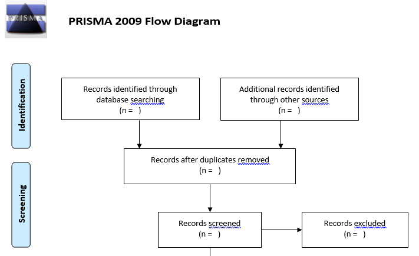
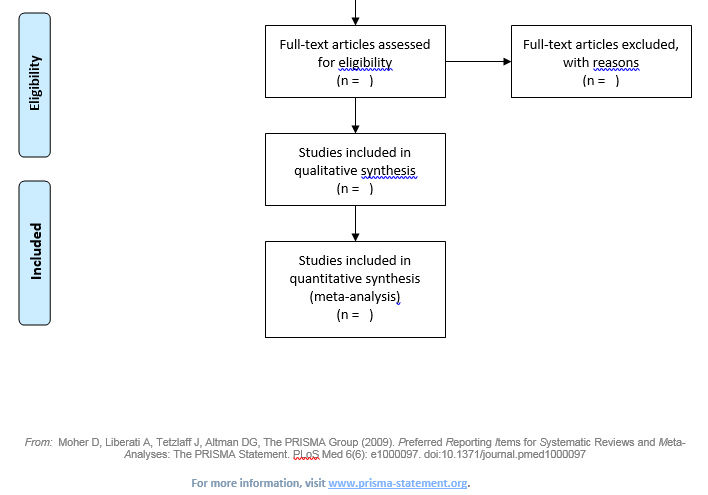
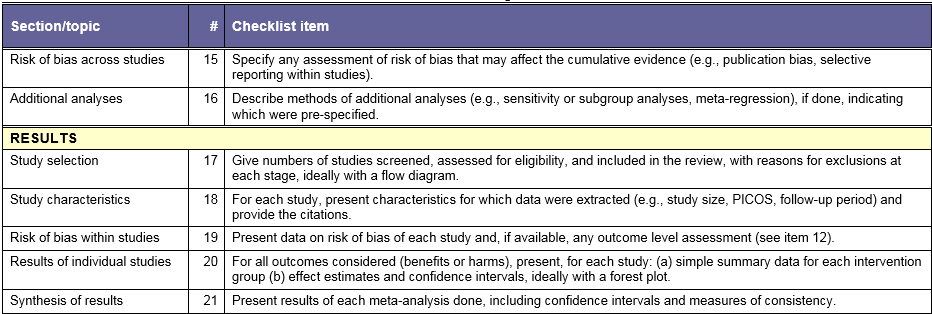
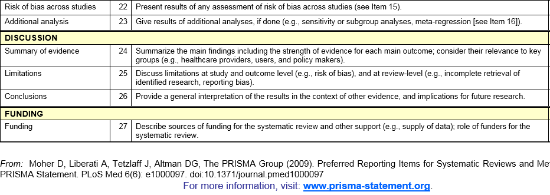

```{r prelims, echo=FALSE}
library(knitr)
opts_chunk$set(echo=FALSE, fig.width=6.5, fig.height=6.5)
library(magrittr)
suppressMessages(suppressWarnings(library(metafor)))
bcg <- get(data(dat.bcg))
los <- get(data(dat.normand1999))
```

## Overview

This presentation will show how to use base R functions to reproduce the forest plot and funnel plot that is produced by the metafor package. It will also try to motivate how you should interpret patterns in these plots.


## BCG description

"Results from 13 studies examining the effectiveness of the Bacillus Calmette-Guerin (BCG) vaccine against tuberculosis."

Available at https://rdrr.io/cran/metafor/man/dat.colditz1994.html

## BCG data, first three columns

```{r bcg-list1}
bcg[ , c("trial", "author", "year")]
```

## BCG data, last six columns

```{r bcg-list2}
bcg[ , c("tpos", "tneg", "cpos", "cneg", "ablat", "alloc")]
```

```{r bcg-fe, comment=""}
bcg_fixed_effects <- rma(
  method="FE",
  measure="OR", 
  ai=tpos, bi=tneg, 
  ci=cpos, di=cneg,
  data=bcg, slab=paste(author, year))
bcg_fixed_effects_text <-
  capture.output(bcg_fixed_effects)
cat(bcg_fixed_effects_text, sep="\n")
forest(bcg_fixed_effects)
```


Here are the results for the first study, listed in a two by two table. A positive result is bad, indicating that the vaccine did not work.

```{r table}
v <- bcg[1, c("tpos", "tneg", "cpos", "cneg")]
m <- matrix(v, nrow=2, byrow=TRUE)
dimnames(m) <- list(
  c("T", "C"),
  c("Pos", "Neg")
)
m
odds <- unlist(m[, 1])/unlist(m[, 2])
or <- odds[1]/odds[2]
log.or <- log(or)
odds <- round(odds, 3)
or <- round(or, 3)
log.or <- round(log.or, 3)
```

Calculate the odds for each row.

```{r odds, echo=FALSE}
cat(paste(v[1], "/", v[2], "=", odds[1]))
cat("\n")
cat(paste(v[3], "/", v[4], "=", odds[2]))
```
The ratio of these two odds is the odds ratio.

```{r or, echo=FALSE}
cat(paste(odds[1], "/", odds[2], "=", or))
```

The underlying distribution of the odds ratio is almost always skewed right and bounded below by zero, so you should consider a log transformation.

```{r log-or, echo=FALSE}
cat(paste0("log(", or, ")=", log.or))
```


The variance of the log odds ratio is approximately

$\frac{1}{n_{11}} + \frac{1}{n_{12}} + \frac{1}{n_{21}} + \frac{1}{n_{22}}$

where n11, n12, etc. are the count of each cell in the two by two table. For the first study, you get

```{r v, echo=FALSE}
var <- round(sum(1/v), 3)
cat(paste0(paste0("1/", v, collapse=" + "), " = ", var))
```

The approximate confidence interval for the log odds is

```{r ci, echo=FALSE}
lo <- round(log.or-1.96*sqrt(var), 3)
hi <- round(log.or+1.96*sqrt(var), 3)
cat(paste0(log.or, "-1.96*", var,"=", lo))
cat(paste0(log.or, "+1.96*", var,"=", hi))
```

These limits include the value of zero, so this particular study failed to reject the null hypothesis.


The log odds ratios and variances for the full data set are listed below.

```{r, full-log-or, echo=FALSE}
bcg_or <- escalc(
  measure="OR", data=dat.bcg,
  ai=tpos, bi=tneg, 
  ci=cpos, di=cneg)
b <- data.frame(y=round(bcg_or$yi,2), w=round(1/bcg_or$vi,1))
b
y <- round(sum(b$y*b$w)/sum(b$w), 2)
```

The weights for a fixed effects analysis are the inverse of the variances. 

 $w_i = \frac{1}{V(\hat \theta_i)}$ 
 
The overall estimate is the weighted average of the individual estimates.

 $\hat \theta = \frac{\Sigma w_i \hat \theta_i}{\Sigma w_i}$

= ((`r b$y[1]`)(`r b$w[1]`)+...+(`r b$y[13]`)(`r b$w[13]`)) / (`r b$w[1]`+...+ `r b$w[13]`) = `r y`.

## Analyzing proportions

* Odds ratio

* Relative risk

* Risk difference

Odds ratios and relative risk are always analyzed and displayed on a log scale.

<div class="notes">

When you are comparing proportions rather than means, you have three ways of summarizing your data. You can use the odds ratio, the relative risk, or the risk difference in proportions.

</div>


## Fixed effects model

 $V(\hat \theta_i) \approx \frac{1}{n_T}+\frac{1}{n_C}\;(SMD)$
 
 $  \approx \frac{1}{n_{11}} + \frac{1}{n_{12}} + \frac{1}{n_{21}} + \frac{1}{n_{22}}\;(log\;OR)$
 
 $w_i = \frac{1}{V(\hat \theta_i)}$ 
 
<div class="notes">

Once you have your standardized mean differences, you can compute an overall estimate, but you need to account for the fact that some estimates are more precise than others.

The variance of the standardized mean difference is approximated by a simple function of the sample sizes in the treatment and control for the standardized mean difference and by a simple function of the four cell counts for the log odds ratio. You should calculate a weight equal to the inverse of the variance to insure that the studies with the largest sample sizes (and thus the greatest precision) get weighted more heavily.

</div>

## Fixed effects model (cont'd)

 $\hat \theta = \frac{\Sigma w_i \hat \theta_i}{\Sigma w_i}$
 
 $V(\hat \theta) = \frac{1}{\Sigma w_i}$ 

 $\frac{\hat \theta^2}{V(\hat \theta)} \sim \chi^2(1)$ 

<div class="notes">

The overall estimate, theta-hat is a weighted average of the individual study estimates. If you take the square of the overall estimate and divide by the estimated variance of the overall estimate, you get a statistic for testing the hypothesis that the overall mean difference is zero.

Compare this test statistic to a chi-squared distribution with 1 degree of freedom.

</div>

## Cochrane's Q

Test of homogeneity

 $Q = \Sigma w_i(\hat \theta_i - \hat \theta)^2$

 $Q \sim \chi^2(k-1)$

 $I^2 = 100\frac{Q-(k-1)}{Q}$

<div class="notes">

Heterogeneity will manifest itself with a greater degree of variation from one study to another than the amount you'd expect due to the sample sizes in each study.

If the value of Q is close to its degrees of freedom (k-1), then you have evidence that the studies are homogenous. If the value of Q is much larger than the degrees of freedom, then you have evidence of heterogeneity.

I-squared is a measure of the degree of heterogeneity that ranges between 0 and 100.

</div>

## Random effects model

Rough approximation

 $\hat \tau^2 = max(0, Q - (k-1))$

 $W_i^* = \frac{1}{V(\hat \theta_i) + \hat \tau^2}$

<div class="notes">

You can fit a random effects model using standard software like PROC MIXED in SAS. The random effects model assumes that each study has an extra source of random variation, caused by the numerous small differences that occur from one study to another. The weights in a random effects meta-analysis are closer to one another, much closer to one another when the variance componet (tau-hat squared) is large.

</div>

## Random effects model for LOS data

```{r rma_los, comment=""}
los_random_effects <- rma(
  measure="SMD", 
  m1i=m1i, sd1i=sd1i, n1i=n1i, 
  m2i=m2i, sd2i=sd2i, n2i=n2i, 
  data=los, slab=source)
los_random_effects_text <-
  capture.output(los_random_effects)
cat(los_random_effects_text[12:15], sep="\n")
```

## Random effects model for BCG data

```{r rma_bcg, comment=""}
bcg_random_effects <- rma(
  measure="OR", 
  ai=tpos, bi=tneg, 
  ci=cpos, di=cneg,
  data=bcg, slab=paste(author, year))
bcg_random_effects_text <-
  capture.output(bcg_random_effects)
cat(bcg_random_effects_text[12:15], sep="\n")
```

## Test of homogeneity for the LOS data

```{r homogeneity-los, comment=""}
cat(los_random_effects_text[4:10], sep="\n")
```

## Test of homogeneity for the BCG data

```{r homogeneity-bcg, comment=""}
cat(bcg_random_effects_text[4:10], sep="\n")
```

## Forest plot for the LOS data

```{r forest_los}
forest(
  los_random_effects,
  cex=0.8)
```

## Forest plot for the BCG data

```{r forest_bcg}
forest(
  bcg_random_effects, 
  cex=0.8)
```

## Funnel plot for the LOS data

```{r funnel_los}
funnel(los_random_effects)
```

## Funnel plot for the BCG data

```{r funnel_bcg}
funnel(bcg_random_effects)
```

## L'Abbe plot

```{r labbe-plot}
bcg_risk_difference <- rma(
  measure="RD", 
  ai=tpos, bi=tneg, 
  ci=cpos, di=cneg,
  data=bcg, slab=paste(author, year))
labbe(bcg_risk_difference)
```

## L'Abbe plot on log odds scale

```{r labbe-plot-log}
labbe(bcg_random_effects)
```

## Meta regression

```{r meta-regression, comment=""}
meta_regression_bcg <- rma(yi, vi, mods = ~ ablat + year, data=bcg_or)
meta_regression_bcg_text <-
  capture.output(meta_regression_bcg)
cat(meta_regression_bcg_text[13:21], sep="\n")
```

## Change in heterogeneity for meta regression model

```{r change-in-heterogeneity, comment=""}
cat(meta_regression_bcg_text[4:11], sep="\n")
```

## Publication guidelines

* PRISMA (2009)

  + Preferred Reporting Items for Systematic Reviews and Meta-Analyses

* QUOROM (1996)

  + QUality Of Reporting Of Meta-analysis
  
## PRISMA flow diagram



## PRISMA flow diagram



## PRISMA checklist, part 1


## PRISMA checklist, part 2


## PRISMA checklist, part 3



## PRISMA checklist, part 4



## Conclusion

* Design of meta-analysis

  + Include a librarian
  
  + Aggressive search strategy
  
* Statistical summary

  + Random versus fixed effects versus meta regression
  
  + Forest, funnel, L'Abbe plots
  
  + Cochrane's Q and I-squared
  
* Reporting

  + PRISMA flow diagram and checklist

```{r save-everything, results=FALSE}
save.image(file="../data/intro.RData")
```