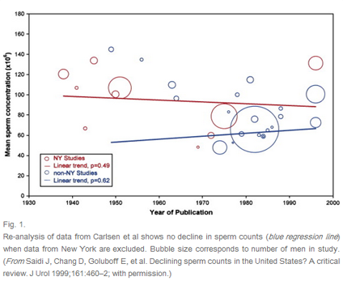
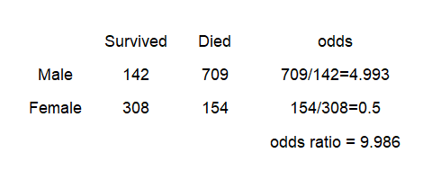
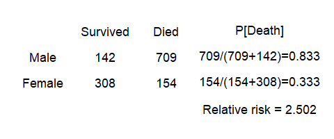
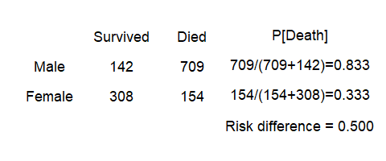
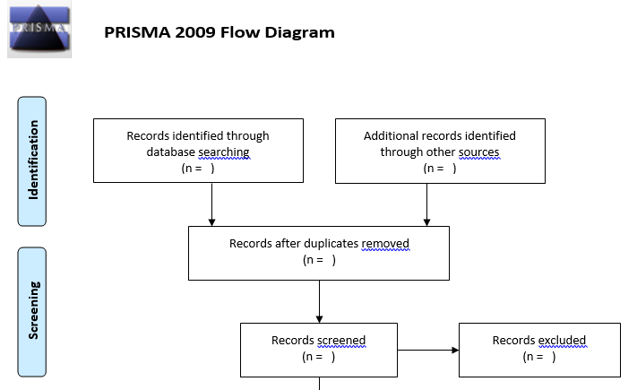
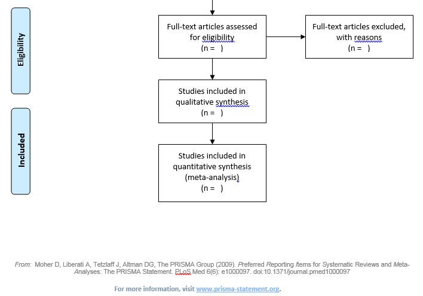
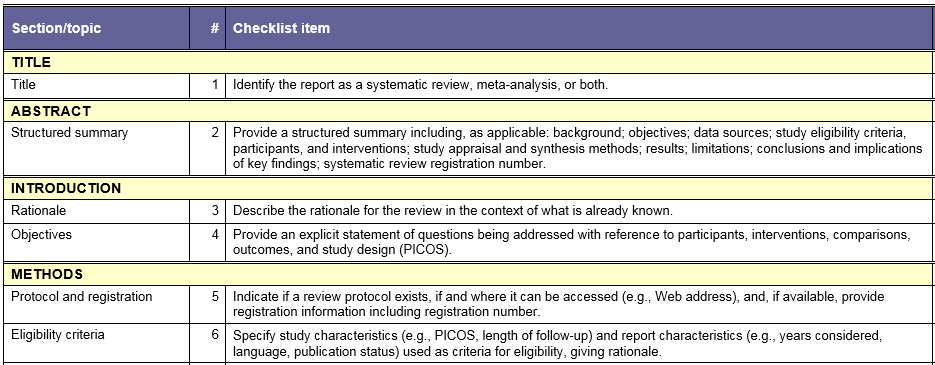
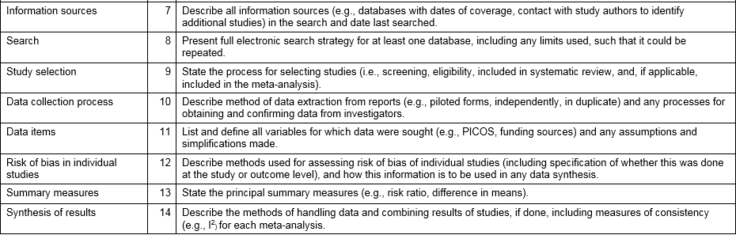
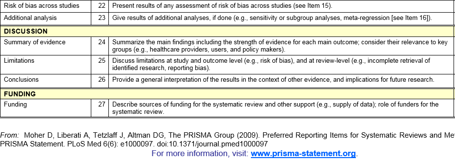

```{r prelims, echo=FALSE}
library(knitr)
opts_chunk$set(echo=FALSE, fig.width=6.5, fig.height=6.5)
library(magrittr)
suppressMessages(suppressWarnings(library(metafor)))
bcg <- get(data(dat.bcg))
los <- get(data(dat.normand1999))
```


## Abstract

Meta-analysis is the quantitative pooling of data from multiple studies. The three threats to the validity of a meta-analytic finding are heterogeneity, publication bias, and poor individual study quality. This talk will introduce you to the major design issues that you must address in your research protocol to insure that your meta-analysis will have credibility. 

<div class="notes">

Today's talk is a basic introduction. It will focus on design issues for a meta-analytic study.

</div>

## Abstract (continued)

You will also learn some of the fundamental graphical and analytic tools used in meta-analysis: the forest plot, Cochran’s Q and I-squared, the funnel plot, and the L’Abbe plot. You will compare the results from a fixed effects and a random effects model and understand the choices available for summary statistics. Finally, you will see how to publish your results using the PRISMA guidelines.

<div class="notes">

It will also cover some of the common statistics and graphics used in a meta-analytic study, and publication standards for a meta-analytic study.

</div>

## A motivating example


<div class="notes">

In 1992, the British Medical Journal published a controversial meta-analysis. This study (Carlsen 1992) reviewed 61 papers published from 1938 and 1991 and showed that there was a significant decrease in sperm count and in seminal volume over this period of time. 
</div>

## A motivating example


<div class="notes">

For example, a linear regression model on the pooled data provided an estimated average count of 113 million per ml in 1940 and 66 million per ml in 1990.

</div>

## Alternative analysis



<div class="notes">

Several researchers (Olsen 1995; Fisch 1996) noted heterogeneity in this meta-analysis, a mixing of apples and oranges. Studies before 1970 were dominated by studies in the United States and particularly studies in New York. Studies after 1970 included many other locations including Third World countries. 

</div>

## Additional sources of variation

* The source of patients
  + Sperm donor clinics,
  + Fertility work-ups
  + In vitro fertilization clinics
* Request for minimum abstinence time.
* Tobacco and marijauna use

<div class="notes">

There was also substantial variation from study to study in the source of patients. Sperm donor clinics typically ask donors to prove they are fertile (e.g., having fathered at least two children). A fertility work-up, on the other hand, is done in settings where fertility is questionable, and would not require such a condition. An in vitro clinic might have men with normal fertility, if the issue of infertility were restricted to the female side. But often a poor sperm count is a contributing factor to female infertility.

Another thing that varied from study to study were absitinence requirements. Some studies asked the men to abstain from sex for two days prior to providing a sample and some didn't. Abstinent men would tend to have higher sperm counts than non-abstinent men.

If patients who used tobacco or marijuana were excluded from some studies, but not from others, this could also affect sperm counts. 

</div>

## Illustration of strengths and weaknesses of meta-analysis

* Weakness

  + Mixing North American apples with third world oranges.
  
* Strengths

  + Objective process.
  
  + Ability to re-analyze.

<div class="notes">

This meta-analysis and the subsequent criticisms illustrate, at the same time, the greatest weakness and the greatest strength of meta-analysis.

</div>

## Apples and oranges

Here are the main threats to the validity of a meta-analysis:

* Did you mix apples and oranges? (heterogeneity)

* Did you leave some apples on the tree? (publication bias)

* Did the pile of apples amount to more than just a hill of beans? (no practical significance)

* Were all of the apples rotten? (poor study quality)

<div class="notes">

One of the seven habits of Steven Covey is "Begin with the end in mind." If you read the criticisms of meta-analysis, they tend to fall into four broad categories. You should design your study and analyze it keeping these criticisms in mind. You want to minimize the number of objections to your work.

</div>

## Did you mix apples and oranges?

Meta-analysis: a multi-center clinical trial where each center uses a different protocol.

How do clinical trials differ?

* How the patient population was selected.

* How the intervention was administered.

* How the controls were selected/treated.

* How the effectiveness of the intervention was measured.

<div class="notes">

There are many ways that one clinical trial can differ from another. One might study a severely ill group of patients and another might study a mildly ill group. The intervention studied could vary in the frequency and duration of the intervention. The controls could be given a placebo or the best available alternative. The outcome used to measure the intervention could be something as severe and final as death or it could be a surrogate marker (e.g., CD4 cell counts in an AIDS trial).

A little bit of heterogeneity is actually quite good. If a new therapy is shown to be effective across a range of patient populations using a variety of different outcomes, you have a robust result. Mixing apples and oranges is okay, it gives you fruit salad. But you're not supposed to mix apples and onions.

</div>

## You can examine heterogeneity using

* the forest plot

* L'Abbe plot

* Cochran's Q

* I-squared

* sensitivity/subgroup analysis

* meta regression

<div class="notes">

You can assess how much heterogeneity there is among your studies using graphical approaches, such as the forest plot and the L'Abbe plot, with numerical measures like Cochran's Q or I-squared, or through sensitivity and subgroup analyses or through meta regression.

You'll see how to calculate these quantities in just a bit.

</div>

## Did you leave some apples on the tree?

Publication bias is difficult to assess and difficult to control for. You should

* have a comprehensive search protocol

  + non-Medline indexed journals
  
  + conference presentations
  
  + clinical trial registries 

* assess publication bias using a funnel plot.

<div class="notes">

It is very important to try to get every study conducted in the area you're studying. Unpublished results and more likely to have negative results. It was originally thought to be because journals would preferentially publish only positive studies, but there is some evidence that authors self-censor the negative studies, especially negative studies with small sample sizes.

You need to try hard to find studies that are hard to find.

The funnel plot is a graphical method commonly used to identify whether publication bias has occured. We'll talk about it in a bit.

</div>

## Did the pile of apples amount to more than just a hill of beans?

Very few meta-analytic studies address practical significance

* Summary measures in meta-analysis are unitless.

* Translate your findings to a meaningful scale.

<div class="notes">

A neglected issue in meta-analysis is the practical interpretation of the results. You need to assess more than just the overall statistical significance of your meta-analysis. You need to consider the scientific or practical significance as well. 

The unitless quantities often used in meta-analysis make assessment of practical significance difficult. We'll address that issue in more detail in just a little bit.

</div>

## Were all of the apples rotten?

Meta-analysis cannot "make a silk purse out of a sow's ear"

Quality scores

* Jadad

* PEDro

<div class="notes">

Meta-analysis cannot remove the biases and imprecision associated with poor research methodologies. If all of the studies have "issues" then a meta-analysis will amplify those issues.

You can assess quality issues by limiting studies based on scoring systems like Jadad or PEDro or by weighting studies based on these scores. We'll talk about this a bit later.

1. Was the study described as randomized (this includes words such as randomly, random, and randomisation)? (+1 Point)
2. Was the method used to generate the sequence of randomisation described and appropriate (table of random numbers, computer-generated, etc)? (+1 Point)
3. Was the study described as double blind? (+1 Point)
4. Was the method of double blinding described and appropriate (identical placebo, active placebo, dummy, etc)? (+1 Point)
5. Was there a description of withdrawals and dropouts? (+1 Point)
6. Deduct one point if the method used to generate the sequence of randomisation was described and it was inappropriate (patients were allocated alternately, or according to date of birth, hospital number, etc)
7. Deduct one point if the study was described as double blind but the method of blinding was inappropriate (e.g., comparison of tablet vs. injection with no double dummy).

1. eligibility criteria were specified no  yes  where:
2. subjects were randomly allocated to groups (in a crossover study, subjects
were randomly allocated an order in which treatments were received) no  yes  where:
3. allocation was concealed no  yes  where:
4. the groups were similar at baseline regarding the most important prognostic
indicators no  yes  where:
5. there was blinding of all subjects no  yes  where:
6. there was blinding of all therapists who administered the therapy no  yes  where:
7. there was blinding of all assessors who measured at least one key outcome no  yes  where:
8. measures of at least one key outcome were obtained from more than 85%
of the subjects initially allocated to groups no  yes  where:
9. all subjects for whom outcome measures were available received the
treatment or control condition as allocated or, where this was not the case,
data for at least one key outcome was analysed by “intention to treat” no  yes  where:
10. the results of between-group statistical comparisons are reported for at least one
key outcome no  yes  where:
11. the study provides both point measures and measures of variability for at
least one key outcome no  yes  where:

</div>

## Design of a meta-analytic study

Detailed protocol

* Get help from a librarian

* Search strategy

* Inclusion/exclusion criteria

* Process for extracting numerical results

<div class="notes">

A detailed protocol is a must for meta-analysis. You have to provide a level of detail comparable to a clinical trial. 
A librarian is especially helpful here.

Medline is a comprehensive database of research publications in medical journals. It's a great place to start, but you should also search in databases other than Medline, such as Embase and CINAHL.

Look through presentation abstracts at major conferences. Also look for clinical trials that have been registered in a clinical trial database.

Make sure you pay to get translations for relevant articles published in languages other than English.

Detail exactly which studies do and do not qualify for inclusion in your meta-analysis. Have two independent raters evaluate each candidate article against your inclusion/exclusion criteria.

Also, detail what results you are going to extract from each article. Have two independent parties do the extraction and then compare.

</div>

## Data analysis

* Pick a summary measure

* Forest plot,

* Cochran’s Q and I-squared,

* Funnel plot

* L’Abbe plot.

* Fixed versus random effects

* Meta regression

<div class="notes">

Let's talk about data analysis. This talk will cover several different statistical measures and several different plots. You'll also see controversies about fixed versus random effects analysis.

</div>

## BCG description

"Results from 13 studies examining the effectiveness of the Bacillus Calmette-Guerin (BCG) vaccine against tuberculosis."

Available at https://rdrr.io/cran/metafor/man/dat.colditz1994.html

## BCG data, first three columns

```{r bcg-list1}
bcg[1:6, c("trial", "author", "year")]
```

## BCG data, last six columns

```{r bcg-list2}
bcg[1:6, c("tpos", "tneg", "cpos", "cneg", "ablat", "alloc")]
```

## LOS description

Results from 9 studies on the length of the hospital stay of stroke patients under specialized care and under conventional/routine (non-specialist) care.

## LOS data, first two columns

```{r los-list-1}
los[1:6, c("study", "source")]
```

## LOS data, last six columns

```{r los-list-2}
los[1:6, c("n1i", "m1i", "sd1i", "n2i", "m2i", "sd2i")]
```

## The standardized mean difference (SMD)

For a continuous outcome, the standardized mean difference is computed as 

 $\hat \theta_i = \frac{\bar{X}_T-\bar{X}_C}{Estimated\;Standard\;Deviation}$

or

 $\hat \theta_i = \frac{\bar{X}_C-\bar{X}_T}{Estimated\;Standard\;Deviation}$

<div class="notes">

For continuous outcomes, the most common summary measure is the standardized mean difference. It is the difference in means divided by an estimate of the standard deviation (not the standard error) of an individual patient.

Which way do you subtract? It depends on whether a large value is good or a small value is good. The Cochrane Collaboration suggests subtracting in such a way that negative values suggest that the new treatment is better and positive values suggest that the control treatment is better.

</div>

## Estimating the standard deviation

Different estimated standard deviations

* Cohen's d (pooled standard deviation)

* Hedge's g (bias correction)

* Adjustments for heteroscedascity or pairing

<div class="notes">

There are several ways to estimate the standard deviation. With the exception of pairing, where the estimated standard deviation could be substantially lower, these approaches are not all that different.

</div>

## Cohen's d

Uses a pooled standard deviation.

 $S_p=\sqrt{\frac{n_TS_T^2+n_CS_C^2}{n_T+n_C}}{\;}$

<div class="notes">

The simplest standardized mean difference is Cohen's d. This is the famous Jacob Cohen who wrote "Statistical Power Analysis for the Behavioral Sciences" back in 1977 and invented to concept of effect size.

Cohen's d uses a pooled standard deviation in the denominator.

</div>

## Hedge's g

Pooled standard deviation adjusted by a bias correction factor

 $J \approx 1-\frac{3}{4df-1}$

<div class="notes">

Hedge's g multiples the pooled standard deviation by a bias correction factor. The exact form of the correction factor is messy, so sometimes an approximate formula based on the pooled degrees of freedom is used in its place.

Both the exact and the approximate bias adjustment formulas are less than one, making Hedge's g smaller than Cohen's d. But for large sample sizes, this adjustment becomes trivial.

</div>

## Adjusting for heteroscedascity

Two choices for heteroscedascity within a study

 $\sqrt{\frac{S_T^2+S_C^2}{2}}{\;}$

or

 $S_C$

<div class="notes">

If there is heterogeneity within a study, you can use the square root of the average the two variances or the square root of the control group variance.

</div>

## Adjusting for pairing

For pairing use

 $S_D$

if it is available, or

 $\sqrt{S_T^2+S_C^2-2\hat\rho S_TS_C}{\;}$

if it is not.

<div class="notes">

For paired data, use the standard deviation of the differences, if it reported, or estimate the standard deviation of the differences using a reasonable guess as to the correlation.

</div>

## Analyzing proportions

* Odds ratio

* Relative risk

* Risk difference

Odds ratios and relative risk are always analyzed and displayed on a log scale.

<div class="notes">

When you are comparing proportions rather than means, you have three ways of summarizing your data. You can use the odds ratio, the relative risk, or the risk difference in proportions.

</div>

## Titanic data


<div class="notes">

You already have seen the various summary measures used for comparing two proportions, but let me review them anyway.

This is table from the Titanic, listing passengers only (not crew members) by gender and by whether they lived or died. Kate Winslet is in the lower left corner of women who survived and Leonardo DiCaprio, sadly, is in the upper right corner of men who died.

</div>

## Odds ratio



<div class="notes">

The ratio of deaths to survivors is about 5 to 1 among men and exactly 1 to 2 among women. So the odds ratio is approximately 10.

</div>

## Relative risk



<div class="notes">

You could also look at the probability of death. It is 83% among men and 33% among women. That ratio, approximately 2.5 is the relative risk.

</div>

## Risk difference



<div class="notes">
  
Rather than dividing one ratio by another, you could subtract one from the other. You get a value of 0.5, which is the risk difference or the absolute risk.

Which measure to choose? There are practical reasons to prefer the relative risk or the risk difference to the odds ratio, but the odds ratio has an important advantage. It is not artificially constrained by any bound. 

The other measures will have an upper bound depending on what the control group is. It is hard to get a relative risk of 2.0 or a risk difference of 0.5 when the proportion in your control group is 0.8.

The artifical constraints of the relative risk and risk difference will sometimes create unwanted heterogeneity in your meta-analysis.
  
</div>

## Standardized mean differences for los data

```{r escalc-smd}
los_smd <- escalc(
  measure="SMD", data=los, 
  m1i=m1i, sd1i=sd1i, n1i=n1i, 
  m2i=m2i, sd2i=sd2i, n2i=n2i)
los_smd[1:6, -(1:2)]
```

## Odds ratios for the BCG data

```{r escalc-or}
bcg_or <- escalc(
  measure="OR", data=dat.bcg,
  ai=tpos, bi=tneg, 
  ci=cpos, di=cneg)
bcg_or[1:6, c("tpos", "tneg", "cpos", "cneg", "yi", "vi")]
```

## Fixed effects model

 $V(\hat \theta_i) \approx \frac{1}{n_T}+\frac{1}{n_C}$
 
 $\approx \frac{1}{n_{11}} + \frac{1}{n_{12}} + \frac{1}{n_{21}} + \frac{1}{n_{22}}$
 
 $w_i = \frac{1}{V(\hat \theta_i)}$ 
 
<div class="notes">

Once you have your standardized mean differences, you can compute an overall estimate, but you need to account for the fact that some estimates are more precise than others.

The variance of the standardized mean difference is approximated by a simple function of the sample sizes in the treatment and control for the standardized mean difference and by a simple function of the four cell counts for the log odds ratio. You should calculate a weight equal to the inverse of the variance to insure that the studies with the largest sample sizes (and thus the greatest precision) get weighted more heavily.

</div>

## Fixed effects model (cont'd)

 $\hat \theta = \frac{\Sigma w_i \hat \theta_i}{\Sigma w_i}$
 
 $V(\hat \theta) = \frac{1}{\Sigma w_i}$ 

 $\frac{\hat \theta^2}{V(\hat \theta)} \sim \chi^2(1)$ 

<div class="notes">

The overall estimate, theta-hat is a weighted average of the individual study estimates. If you take the square of the overall estimate and divide by the estimated variance of the overall estimate, you get a statistic for testing the hypothesis that the overall mean difference is zero.

Compare this test statistic to a chi-squared distribution with 1 degree of freedom.

</div>

## Cochrane's Q

Test of homogeneity

 $Q = \Sigma w_i(\hat \theta_i - \hat \theta)^2$

 $Q \sim \chi^2(k-1)$

 $I^2 = 100\frac{Q-(k-1)}{Q}$

<div class="notes">

Heterogeneity will manifest itself with a greater degree of variation from one study to another than the amount you'd expect due to the sample sizes in each study.

If the value of Q is close to its degrees of freedom (k-1), then you have evidence that the studies are homogenous. If the value of Q is much larger than the degrees of freedom, then you have evidence of heterogeneity.

I-squared is a measure of the degree of heterogeneity that ranges between 0 and 100.

</div>

## Random effects model

Rough approximation

 $\hat \tau^2 = max(0, Q - (k-1))$

 $W_i^* = \frac{1}{V(\hat \theta_i) + \hat \tau^2}$

<div class="notes">

You can fit a random effects model using standard software like PROC MIXED in SAS. The random effects model assumes that each study has an extra source of random variation, caused by the numerous small differences that occur from one study to another. The weights in a random effects meta-analysis are closer to one another, much closer to one another when the variance componet (tau-hat squared) is large.

</div>

## Random effects model for LOS data

```{r rma_los, comment=""}
los_random_effects <- rma(
  measure="SMD", 
  m1i=m1i, sd1i=sd1i, n1i=n1i, 
  m2i=m2i, sd2i=sd2i, n2i=n2i, 
  data=los, slab=source)
los_random_effects_text <-
  capture.output(los_random_effects)
cat(los_random_effects_text[12:15], sep="\n")
```

## Random effects model for BCG data

```{r rma_bcg, comment=""}
bcg_random_effects <- rma(
  measure="OR", 
  ai=tpos, bi=tneg, 
  ci=cpos, di=cneg,
  data=bcg, slab=paste(author, year))
bcg_random_effects_text <-
  capture.output(bcg_random_effects)
cat(bcg_random_effects_text[12:15], sep="\n")
```

## Test of homogeneity for the LOS data

```{r homogeneity-los, comment=""}
cat(los_random_effects_text[4:10], sep="\n")
```

## Test of homogeneity for the BCG data

```{r homogeneity-bcg, comment=""}
cat(bcg_random_effects_text[4:10], sep="\n")
```

## Forest plot for the LOS data

```{r forest_los}
forest(
  los_random_effects,
  cex=0.8)
```

## Forest plot for the BCG data

```{r forest_bcg}
forest(
  bcg_random_effects, 
  cex=0.8)
```

## Funnel plot for the LOS data

```{r funnel_los}
funnel(los_random_effects)
```

## Funnel plot for the BCG data

```{r funnel_bcg}
funnel(bcg_random_effects)
```

## L'Abbe plot

```{r labbe-plot}
bcg_risk_difference <- rma(
  measure="RD", 
  ai=tpos, bi=tneg, 
  ci=cpos, di=cneg,
  data=bcg, slab=paste(author, year))
labbe(bcg_risk_difference)
```

## L'Abbe plot on log odds scale

```{r labbe-plot-log}
labbe(bcg_random_effects)
```

## Meta regression

```{r meta-regression, comment=""}
meta_regression_bcg <- rma(yi, vi, mods = ~ ablat + year, data=bcg_or)
meta_regression_bcg_text <-
  capture.output(meta_regression_bcg)
cat(meta_regression_bcg_text[13:21], sep="\n")
```

## Change in heterogeneity for meta regression model

```{r change-in-heterogeneity, comment=""}
cat(meta_regression_bcg_text[4:11], sep="\n")
```

## Publication guidelines

* PRISMA (2009)

  + Preferred Reporting Items for Systematic Reviews and Meta-Analyses

* QUOROM (1996)

  + QUality Of Reporting Of Meta-analysis
  
## PRISMA flow diagram



## PRISMA flow diagram



## PRISMA checklist, part 1



## PRISMA checklist, part 2



## PRISMA checklist, part 3


## PRISMA checklist, part 4



## Conclusion

* Design of meta-analysis

  + Include a librarian
  
  + Aggressive search strategy
  
* Statistical summary

  + Random versus fixed effects versus meta regression
  
  + Forest, funnel, L'Abbe plots
  
  + Cochrane's Q and I-squared
  
* Reporting

  + PRISMA flow diagram and checklist

```{r save-everything, results=FALSE}
save.image(file="../data/intro.RData")
```