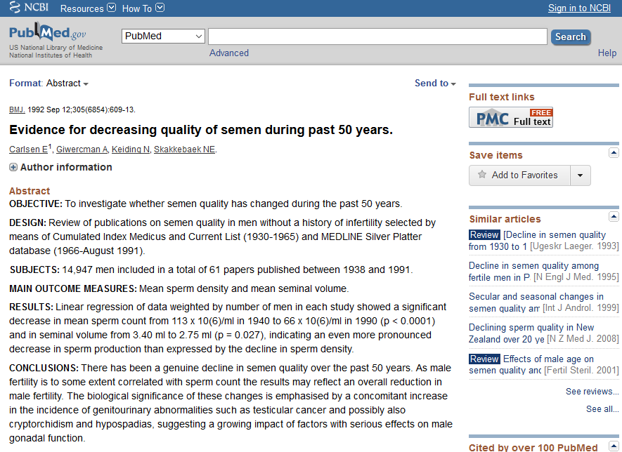
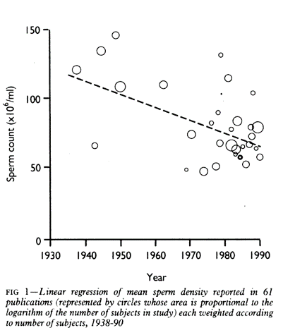

## Abstract

Meta-analysis is the quantitative pooling of data from multiple studies. The three threats to the validity of a meta-analytic finding are heterogeneity, publication bias, and poor individual study quality. This talk will introduce you to the major design issues that you must address in your research protocol to insure that your meta-analysis will have credibility. 

Today's talk is a basic introduction. It will focus on design issues for a meta-analytic study.

## Abstract (continued)

You will also learn some of the fundamental graphical and analytic tools used in meta-analysis: the forest plot, Cochran’s Q and I-squared, the funnel plot, and the L’Abbe plot. You will compare the results from a fixed effects and a random effects model and understand the choices available for summary statistics. Finally, you will see how to publish your results using the PRISMA guidelines.

It will also cover some of the common statistics and graphics used in a meta-analytic study, and publication standards for a meta-analytic study.

## A motivating example

In 1992, the British Medical Journal published a controversial meta-analysis. This study (Carlsen 1992) reviewed 61 papers published from 1938 and 1991 and showed that there was a significant decrease in sperm count and in seminal volume over this period of time. 

## A motivating example

For example, a linear regression model on the pooled data provided an estimated average count of 113 million per ml in 1940 and 66 million per ml in 1990.

## Apples and oranges

Here are the main threats to the validity of a meta-analysis:

* Did you mix apples and oranges? (heterogeneity)

* Did you leave some apples on the tree? (publication bias)

* Did the pile of apples amount to more than just a hill of beans? (no practical significance)

* Were all of the apples rotten? (poor study quality)

## Did you mix apples and oranges?

Meta-analysis: a multi-center clinical trial where each center uses a different protocol.

